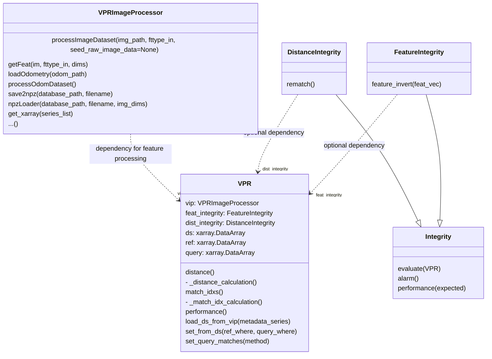

# PYAARAPSI


## Class Structure [PROPOSED]

Since `VPRImageProcessor` already handles the feature creation, saving, loading, etc. that component can be left as is.
The `VPR` class loads the feature data/processed images from a `VPRImageProcessor` object for the query and reference sets and evaluates the feature integrity with the set `FeatureIntegrity` subclass. `VPR.distance()` then can be used to call the feature distance calculation and the distance vector integrity calculation with the assigned `DistanceIntegrity` subclass. Finally, `VPR.matches()` returns the best matches.

This allows changes to the VPR distance calculations, integrity checks, and image processing to be done without large rewrites, but using class inheritance to only change the desired behaviors.


## Semi-pseudo Example Usage

```python
class VPR:
    # lots not shown...

    def set_from_ds(self, ref_where, query_where):
        # set query and reference from the dataset
        self.ref=self.ds[ref_where]
        self.query=self.ds[query_where]
        # reset internal calculations, e.g.
        self._distance = None
        # Run the feature integrity evaluation
        if self.feat_integrity is not None:
            self.feat_integrity.evaluate(self)

    def distance(self):
        # Calculate distance if not already calculated
        if self._distance is None:
            # Run the distance calculation
            self._distance = self._distance_calculation()
            # Run the distance integrity evaluation
            if self.dist_integrity is not None:
                self.dist_integrity.evaluate(self)
        return self._distance

class VPR_sequential(VPR):
    # A VPR subclass which uses a convolutional sequential metric for distance
    def _distance_calculation(self):
        # Calculate sequential distance instead of euclidean
        pseudo_code_convolve(self.ref.data, self.query.data)

def vpr_test_setup1(vpr_class)
    vip = VPRImageProcessor()
    vip.npzLoader('ref_path') # Load data

    vpr = vpr_class(vip)
    vpr.load_ds_from_vip()
    vpr.set_from_ds(ref_where=(vpr.ds.file_idx % 20 == 0), # take every 20th image
                    query_where =(vpr.ds.file_idx % 5 == 0) # take every 5th image
        )
    vpr.set_query_matches('xy odometry') # Set the 'true' matches from the odometry
    return vpr.performance() # Produce performance report

# Compare the new VPR_sequential class performance to the original class performance

test_setup1(VPR)
test_setup1(VPR_sequential)

# Another example test setup example for alternative integrity classes

def integrity_test_setup1(integrity_class):
    vip = VPRImageProcessor()
    vip.npzLoader('ref_path') # Load data

    vpr = VPR(vip)
    vpr.dist_integrity = integrity_class
    vpr.load_ds_from_vip()
    vpr.set_from_ds(ref_where=(vpr.ds.file_idx % 20 == 0), # take every 20th image
                    query_where =(vpr.ds.file_idx % 5 == 0) # take every 5th image
        )
    vpr.set_query_matches('xy odometry') # Set the 'true' matches from the odometry
    vpr.distance()
    # Evaluate distance integrity performance against some boolean metadata
    return vpr.dist_integrity.performance(vpr.query.in_tolerance_bool) # Produce performance report
```